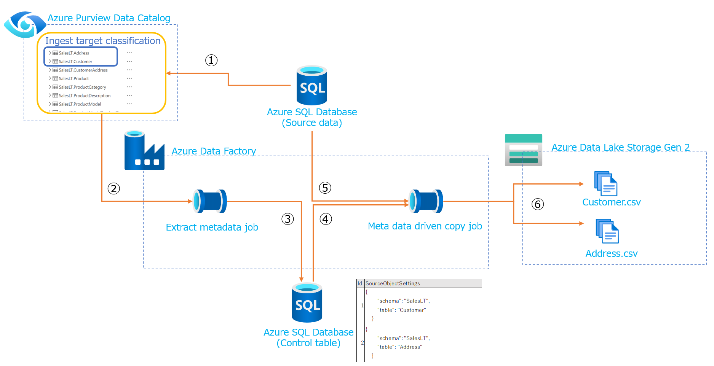

# Purview データカタログ駆動データインジェストソリューション

## 概要

Data Factoryはコピージョブにパラメータの概念を適用することで、数千規模のテーブルの取り込みを個別にデプロイするのではなく、単一（または少数）のパイプライン定義で実行することが可能です。
このリポジトリでは、このメタデータ駆動パイプラインの機能を拡張し、Azure Purviewデータカタログで取り込み対象タグを付与することで、データ取り込みの対象を決定する、データカタログ駆動のデータインジェストソリューションのプロトタイプをデプロイします。

メタデータ駆動パイプライン：
[データのコピー ツール (プレビュー) でメタデータ駆動型の方法を使用して大規模なデータ コピー パイプラインを作成する](https://docs.microsoft.com/ja-jp/azure/data-factory/copy-data-tool-metadata-driven)

Data Factory はPurview のデータカタログに対するAPI接続を利用して、取り込み対象のテーブルの情報を取得し、メタデータ駆動パイプライン用の制御テーブルに記録します。

1. Purviewによりデータソースシステムからスキャンされたメタデータ（テーブル名、スキーマ、データベース名など）に取り込み対象用の分類タグを付与します。
2. Data Factoryが取り込み対象のメタデータを検索、抽出します。
3. 抽出された対象テーブルの情報を制御テーブルに記録します。
4. メタデータ駆動パイプラインは制御テーブルの情報を利用して、対象のテーブルを特定します。
5. 特定された対象テーブルを抽出します。
6. データレイクに蓄積します。

## 前提条件

- 権限：サブスクリプションの所有者

## 制限事項

- 全件抽出のみに対応しています、（制御テーブルのレコート内容変更で対応可能）
- 対象としているのはAzure SQLのみです。

## 次の手順

- [ARMテンプレートによるデプロイ](docs/arm.md)
- [Azure Dev Opsによるデプロイ](docs/devops.md)