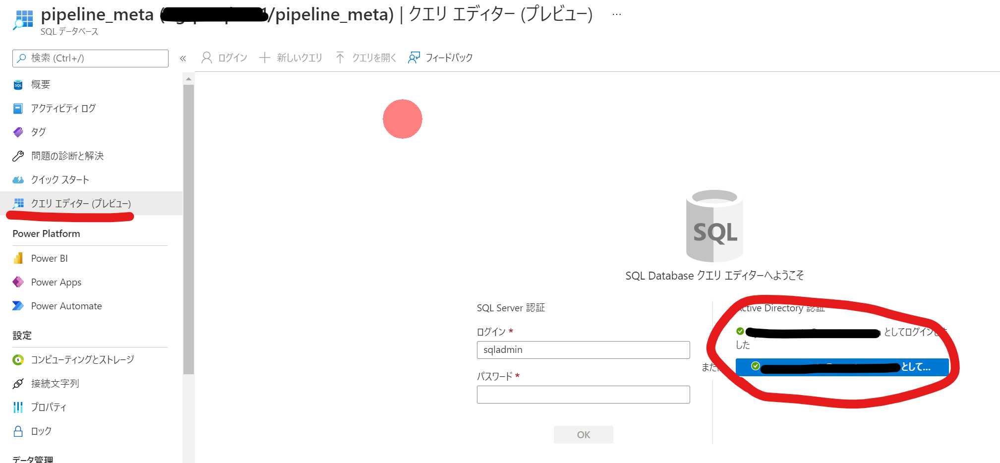

# ARM Templateによるデプロイ手順

## 前提条件

- 権限：サブスクリプションの所有者

## 1. リソースのデプロイ

以下のボタンからリソースをデプロイします。

## 各種設定

## 2. Azure SQL Databaseの設定

### 2-1. Azure AD管理者設定

デプロイパラメータで自身のオブジェクトID,ユーザープリンシパル名を空欄でデプロイした場合は、以下の手順にしたがって自分をAzure SQL AD管理者に設定します。

[Azure AD 管理者をプロビジョニングする (SQL Database)](https://docs.microsoft.com/ja-jp/azure/azure-sql/database/authentication-aad-configure?tabs=azure-powershell#azure-portal-1)

## 2-2. メタデータ用オブジェクトの作成

pipeline_metaリソースに移動し、クエリエディターをAD認証でログインします。

以下の3点のSQLを実行します。

- [テーブル作成](../src/PipelineMetastoreDatabase/dbo/Tables/MainControlTable.sql)
- [Insertストアドプロシージャ作成](../src/PipelineMetastoreDatabase/dbo/StoredProcedures/usp_insert_metadata.sql)
- [Deleteストアドプロシージャ作成](../src/PipelineMetastoreDatabase/dbo/StoredProcedures/usp_delete_metadata.sql)

## 次の手順

[リソースの初期設定](resourceSetting.md)
