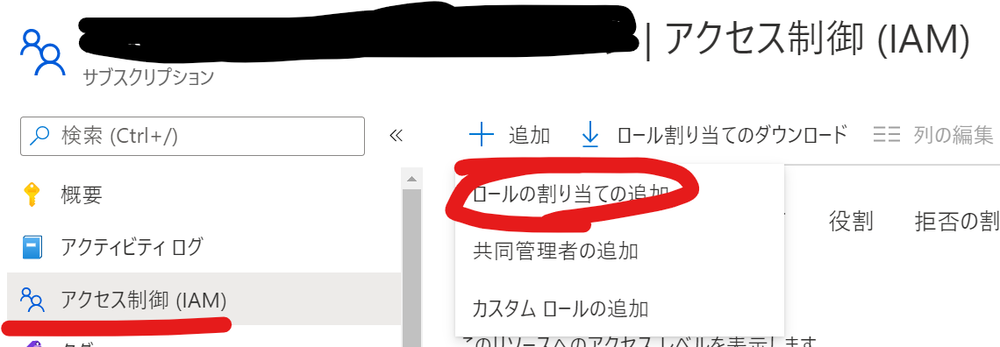

# Azure Dev Opsによるデプロイ

## 1. DevOps パイプラインの実行

### 1-2. サービス接続の作成

1. [サービス接続を作成する](https://docs.microsoft.com/ja-jp/azure/devops/pipelines/library/service-endpoints?view=azure-devops&tabs=yaml#create-a-service-connection)を参照して、サービス接続を`azure-devops-service-connection`という名称で作成します。

2. サブスクリプションに移動し、「アクセス制御（IAM）」→「＋追加」→「ロールの割り当ての追加」の順にクリックします。

3. 「ユーザーアクセス管理者」を選択します。

4. DevOpsプロジェクト名などで検索し、サービス接続用のサービスプリンシパルを選択し、権限を割当てます。

### 1-3. 変数グループの作成

1. DevOps Pipeline 上の「Library」→「＋Variable Group」の順にクリックします。

2. 「Variable group name」に`demo-vg`と入力し、各変数を設定し、「save」をクリックします。

変数の説明

| 変数                    | 説明                        | 備考                            |
|-----------------------|---------------------------|-------------------------------|
| AZURE_LOCATION        | デプロイ先のAzure リージョン         | Purivewリソースは現在東南アジアにデプロイされます。 |
| AZURE_SUBSCRIPTION_ID | デプロイするサブスクリプションID         |                               |
| DEPLOY_ID             | 作成されるリソースを一意にするための任意の3桁数字 |                               |
| PREFIX                | リソースの接頭辞となる任意の4桁文字列       |                               |
| USER_OBJECT_ID        | 自身のIDを入力してください            | [確認方法](AzureADWhoamI.md)                              |
| USER_PRINCIPAL_NAME   | 自身のユーザー名を入力してください。        | user名@ドメイン名の形式                |

### 1-4. リポジトリのインポート

1. [Git リポジトリをインポートする](https://docs.microsoft.com/ja-jp/azure/devops/repos/git/import-git-repository?view=azure-devops)を参考に、 `https://github.com/ryoma-nagata/purview-data-catalog-driven-ingest.git`からリポジトリをインポートします。※認証不要

### 1-5. DevOps パイプラインの読み込みと実行

1. 「Pipelines」に移動し、「Create Pipeline」をクリックします。

2. 「Azure Repost Git」を選択します。

3. リポジトリを選択後、「Existing Azure Pipelines YAML file」を選択します。

4. `/.ado/workflows/azure-pipelines.yml`を選択し、「continue」をクリックします。

5. 「Run」をクリックします。

6. 必要に応じて、変数グループへのアクセスを承認します。 

7. Azure Pipelineが完了しリソースがデプロイされます。

## 2. Purview の権限設定

### 2-1. アクセス許可の構成

1. https://web.purview.azure.com/ から、Purviewリソースを選択し、Purview Studioに移動します。

2. 「Data Map」に移動し、「Collections」→「Role assignments」→「Data Curator」および、「Data Source Admin」に自分自身を追加します。

## 次の手順

[リソースの初期設定](resourceSetting.md)