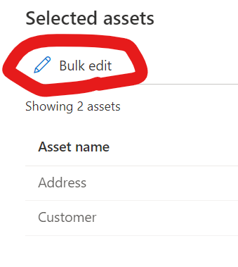
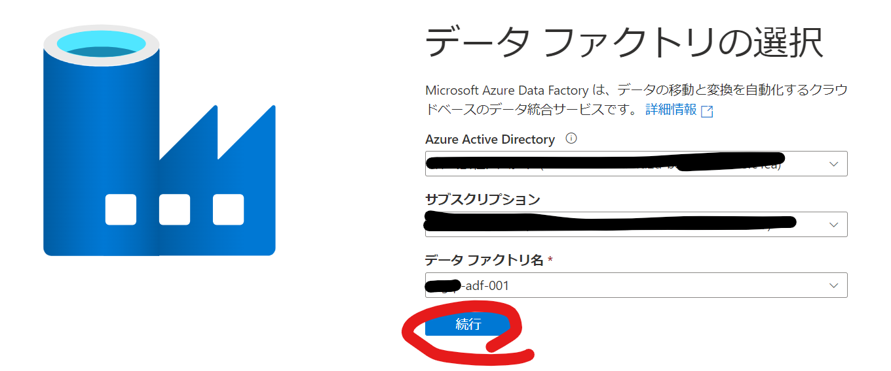

# メタデータの登録と取り込みパイプラインの実行

## 1. 対象テーブルの設定

1. https://web.purview.azure.com/ から、Purviewリソースを選択し、Purview Studioに移動します。

2. カタログ欄で`sql table`を入力して検索します。

3. 任意のテーブルを選択して、「View Selected」をクリックします。

4.「Bulk edit」をクリックします。

5. 「Attribute」に`Classification`、「Operation」に`Add`、「New Value」に`MetadataDrivenCopyTask_0mc_TopLevel` を設定し、「Apply」をクリックします。

## 2. パイプラインの実行

### 2-1. メタデータ登録パイプラインの実行
1. https://adf.azure.com/に移動して、Data Factoryリソースを選択し、Purview Studioに移動します。

2. 「作成者」→パイプライン内の「InsertFromPurviewMetadataomc2」→「トリガーの追加」→「今すぐトリガー」の順にクリックします。

3. Purviewのリソース名をパラメータ「purviewName」に設定します。

各パラメータの説明

| パラメータ                         | 説明                                                                                                  | 備考   |
|-------------------------------|-----------------------------------------------------------------------------------------------------|------|
| purviewName                   | 連携設定をしたPurviewリソース名                                                                                 |      |
| MetadataDrivenCopyTaskTopName | メタデータ駆動取り込みパイプラインの名称。取り込み対象テーブル情報を制御テーブルに挿入する際、この値が付与され、取り込みパイプラインは自身の名称で制御テーブルから取り込み対象テーブルを絞り込みます。 |      |
| MainControlTableName          | 制御テーブル名                                                                                             |      |
| rootFolderPath                | 取り込み先のルートフォルダ                                                                                       | 変更可能 |
| fileSystemName                | 取り込み先のストレージファイルシステム                                                                                 |

4. 実行完了後、制御テーブルに対象のテーブルの情報が登録されます。

### 2-2. メタデータ駆動インジェストパイプラインの実行

1. 「MetadataDrivenCopyTask_0mc_`TopLevel`」→「トリガーの追加」→今すぐトリガーをクリックします。

2. このまま実行します;

各パイプラインの詳細は[データのコピー ツール (プレビュー) でメタデータ駆動型の方法を使用して大規模なデータ コピー パイプラインを作成する](https://docs.microsoft.com/ja-jp/azure/data-factory/copy-data-tool-metadata-driven)を参照ください。

3. データレイクにデータが登録されたことを確認します。

