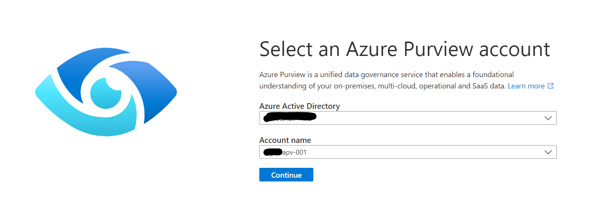

# リソースの初期設定

## 1. DBアクセス

### 1-1. AdventureWorksLT データベースのアクセス設定

AdventureWorksLTリソースに移動し、クエリエディターをAD認証でログインします。


以下のSQLを実行します。

```sql

CREATE USER [<Data Factory リソース名>] FROM EXTERNAL PROVIDER;
ALTER ROLE [db_datareader] ADD MEMBER [<Data Factory リソース名>];

CREATE USER [<Purview リソース名>] FROM EXTERNAL PROVIDER;
ALTER ROLE [db_datareader] ADD MEMBER [<Purview リソース名>];

```

### 1-2. pipeline_meta データベースのアクセス設定

pipeline_metaリソースに移動し、クエリエディターをAD認証でログインします。


以下のSQLを実行します。

```sql

CREATE USER [<Data Factory リソース名>] FROM EXTERNAL PROVIDER;
ALTER ROLE [db_owner] ADD MEMBER [<Data Factory リソース名>];


```

## 2. Purviewカタログ設定

https://web.purview.azure.com/ から、Purviewリソースを選択し、Purview Studioに移動します。




### 2-1. Azure SQL ソース登録

1. 「Data Map」に移動し、「Register」を選択します。


2. 「Azure SQL Database」を選択します。


3. 作成したSQL Serverのリソースを選択し、「Register」をクリックします。


### 2-2. AdventureWorksLTデータベースのスキャン実行

1. 「New Scan」をクリックします。


2. 「AdventureWorksLT」を選択し、「Continue」をクリックします。


3. 「Continue」をクリックします。


4. 「Continue」をクリックします。


5. 「Once」を選択し、「Continue」をクリックします。


6. 「Save and run」をクリックします。


### 2-3. 分類の作成

1. 「Data Map」に移動し、「Classifications」→「＋New」の順にクリックします。


2. 「Name」に`MetadataDrivenCopyTask_0mc_TopLevel`を設定し、「OK」をクリックします。


### 2-4. Data Factoryリソースへの権限割り当て

1. 「Data Map」に移動し、「Collections」→「Role assignments」→「Data Curator」にてData Factoryリソースを追加します。


2. 「Data Reader」にてData Factoryリソースを追加します。


## 次の手順

[メタデータの登録と取り込みパイプラインの実行](executePipeline.md)